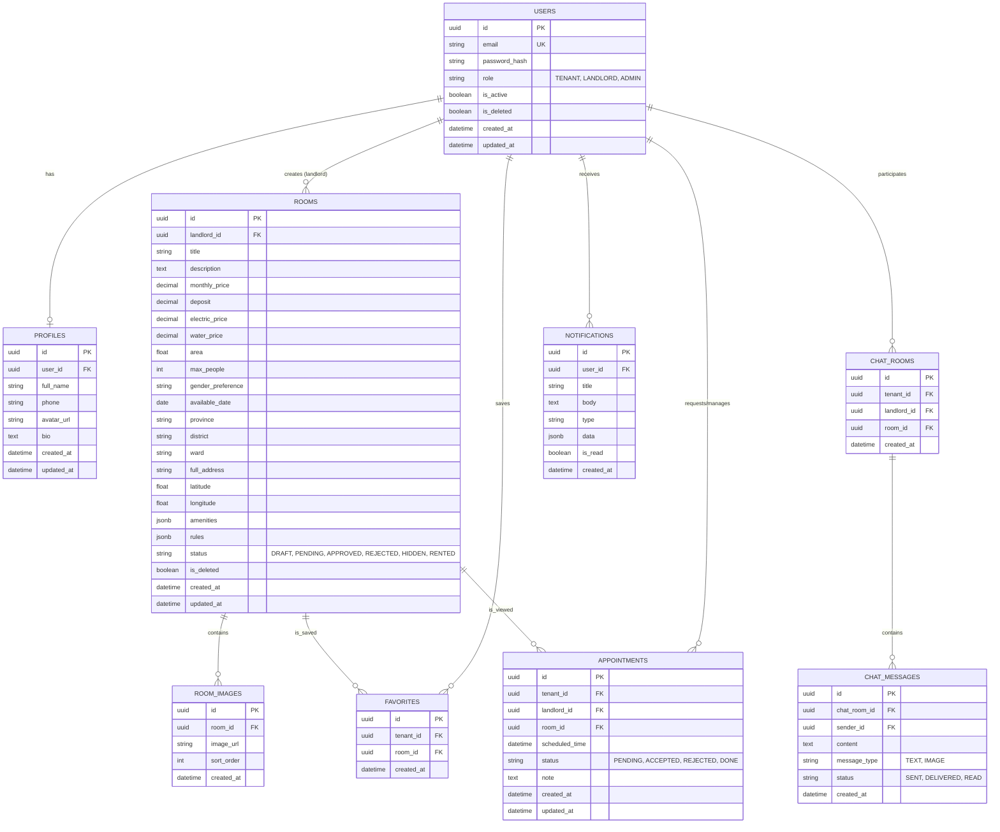

# Database Schema & ERD

## Architecture Decisions
- **Soft Delete**: Implemented via an `is_deleted` boolean flag and `deleted_at` timestamp.
- **Audit Timestamps**: `created_at` and `updated_at` on every table.
- **Indexing**: 
  - GIN indexes with `pg_trgm` on `Room.title` and `Room.description` to avoid slow `LIKE '%keyword%'` queries.
  - B-Tree indexes on frequently filtered columns (`district`, `ward`, `price`, `area`, `status`).
  - Spatial searches: For this scope, we use simple latitude/longitude bounding box queries or PostGIS (if installed, though standard indexing on lat/lng with simple math works for small scales).

## Entity Relationship Diagram (Mermaid)

## Redis Keys
- **Search Cache**: `room:search:{query_hash}` -> JSON (TTL: 120s)
- **Room Detail Cache**: `room:detail:{id}` -> JSON (TTL: 300s)
- **User Online Status**: `user:online:{id}` -> Timestamp (TTL: 60s)
- **Typing Indicator**: `chat:typing:{chat_room_id}:{user_id}` -> bool (TTL: 5s)
- **Favorite Counter**: `room:favorites:{id}` -> int
- **View Counter**: `room:views:{id}` -> int
- **Token Blacklist**: `jwt:blacklist:{jti}` -> bool (TTL: expiration)
